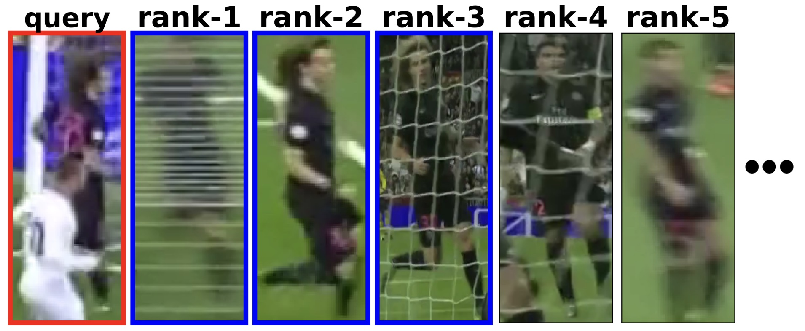
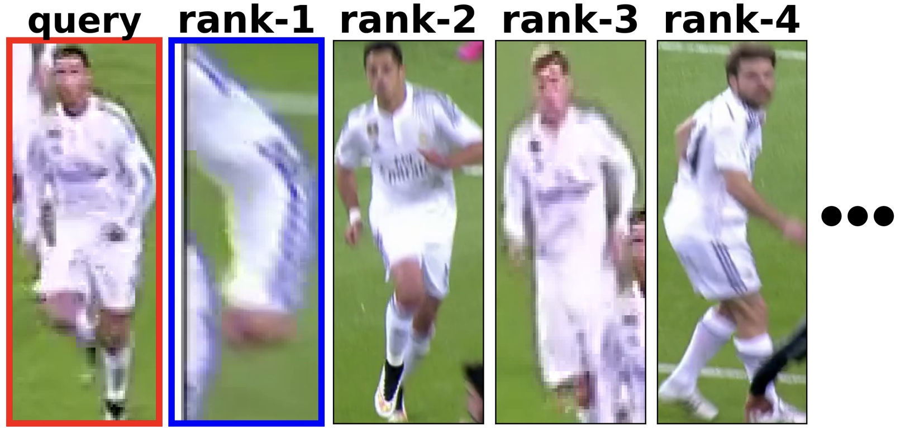

 



<!---
## Hierarchical Sampling

The hierarchical sampler is defined in [torchreid/data/sampler.py](torchreid/data/sampler.py) as [RandomIdentitySampler_Hierarchical](https://github.com/dhagesakshi/sportsreid/blob/dcd1fccf0d3b2921edfd089d010e9512ff61fe51/torchreid/data/sampler.py#L15). To use it, just set "train_sampler" to "RandomIdentitySampler_Hierarchical" in the yaml config file.

## Centroid loss

The centroid loss is defined in [torchreid/losses/hard_mine_triplet_loss.py](https://github.com/dhagesakshi/sportsreid/blob/dcd1fccf0d3b2921edfd089d010e9512ff61fe51/torchreid/losses/hard_mine_triplet_loss.py#L91). To use it, set "weight_cc" to a value > 0.0 in the yaml config file.

-->


## Metrics, Pretrained Models and Config Files

We provide trained models and config files for different network architectures in the table below. These models were pretrained on ImageNet and then trained on the train split of the SoccerNet Re-Identification dataset.

| name | #params | Resolution | mAP | rank-1 | chkpt | config |
| ---  | --- | --- | --- | --- | --- | --- |
| ResNet50-fc512 | 24.6M | 256x128 | 81.8 | 76.1 | [model](https://drive.google.com/file/d/1o45E8lxB9mxJ1lfSgMpi3mC0zUwVvzgz/view?usp=sharing) | [config](https://drive.google.com/file/d/1CqtCPpn9NSlZ5NMmGUqWfd-fcOOWVyOu/view?usp=sharing) |
| OSNet_x1_0 | 2.2M | 256x128 | 83.4 | 78.0 | [model](https://drive.google.com/file/d/1To0Ww6_HxU2ITAlb4kQEgYExV-orwit8/view?usp=sharing) | [config](https://drive.google.com/file/d/1xO4Qe7f4FwpXnEe39cn24FdRDg6F-LLu/view?usp=sharing) |
| DeiT-Tiny/16 | 5.5M | 224x224 | 82.2 | 76.2 | [model](https://drive.google.com/file/d/1u6SLzk8TTZQt2NvNrE2KNOFB6S67JE1g/view?usp=sharing) | [config](https://drive.google.com/file/d/1wZCXISaGdeyQfgL1MaN7BNVKOZTBwku-/view?usp=sharing) |
| DeiT-S/16 | 21.7M | 224x224 | 84.3 | 79.4 | [model](https://drive.google.com/file/d/1yPgYoxP5a8X5p0LGdB_YHAXHDyRcShIo/view?usp=sharing) | [config](https://drive.google.com/file/d/1wZCXISaGdeyQfgL1MaN7BNVKOZTBwku-/view?usp=sharing) |
| ViT-B/16 | 57.7M | 224x224 | 86.0 | 81.5 | [model](https://drive.google.com/file/d/1yoGabayh4yRGkfzBwmBF1ocNiwwo1WVv/view?usp=sharing) | [config](https://drive.google.com/file/d/1f7JL1sBqThM9J3lL4XrTEAA2k3bVAOl3/view?usp=sharing) |
| ViT-L/16* | 303.6M | 224x224 | 89.8 | 86.7 | [model](https://drive.google.com/file/d/1NHtpTuCCueA1Q8S5li3y4L3oO9lFvte2/view?usp=sharing) | [config](https://drive.google.com/file/d/1ZdHOJwben0drx2xJcaf-UczgKzKReWY6/view?usp=sharing) |

The ViT-L/16* model is trained with 5 different random seeds for initialization and then the weights are averaged across these seeds to further increase mAP. This is inspired by this [paper](https://arxiv.org/abs/2203.05482).

## Installation

```
# cd to your preferred directory and clone this repo
git clone https://github.com/dhagesakshi/sportsreid.git

# create environment
cd sportsreid/
conda create --name sportsreid python=3.7
conda activate sportsreid

# install dependencies
# make sure `which python` and `which pip` point to the correct path
pip install -r requirements.txt

# install torch and torchvision (select the proper cuda version to suit your machine)
conda install pytorch torchvision cudatoolkit=9.0 -c pytorch

# install sportsreid (don't need to re-build it if you modify the source code)
python setup.py develop
```


## Inference

```
python benchmarks/baseline/main.py --config-file <path to config yaml file> test.evaluate True model.resume <path to model checkpoint>
```


